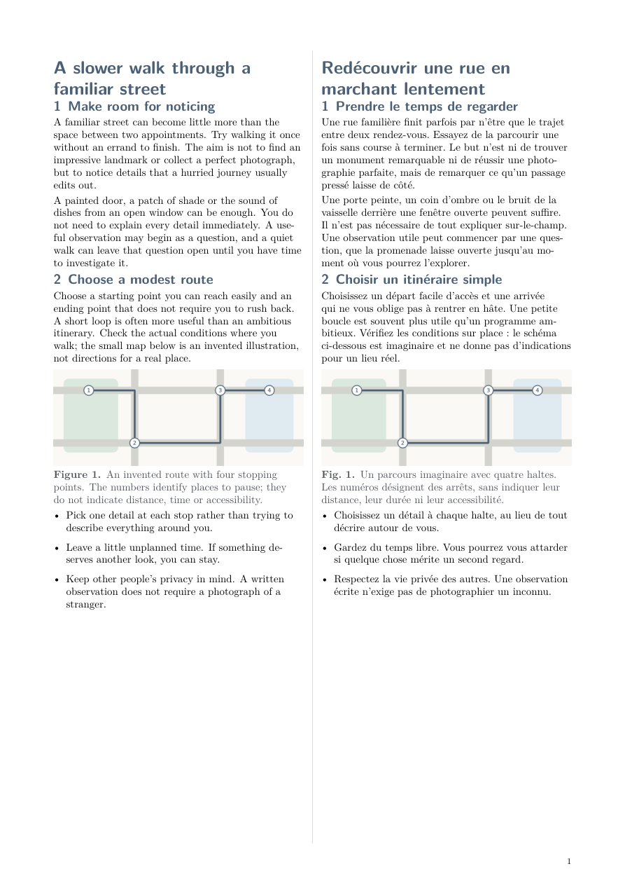
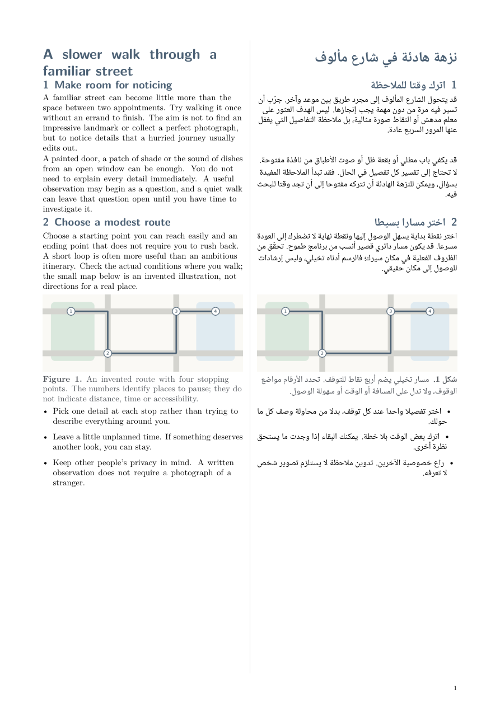
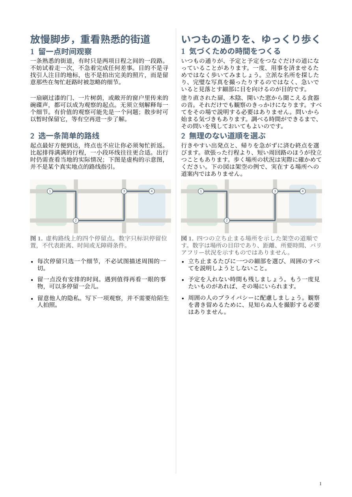
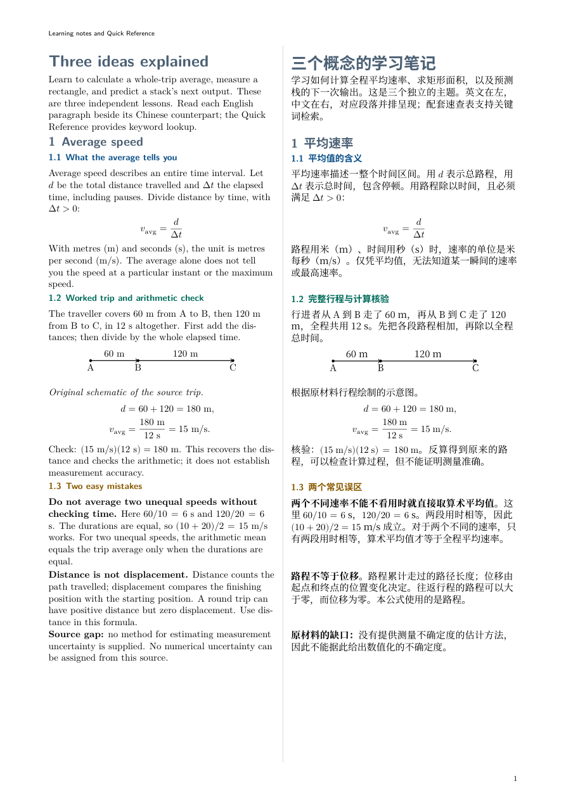
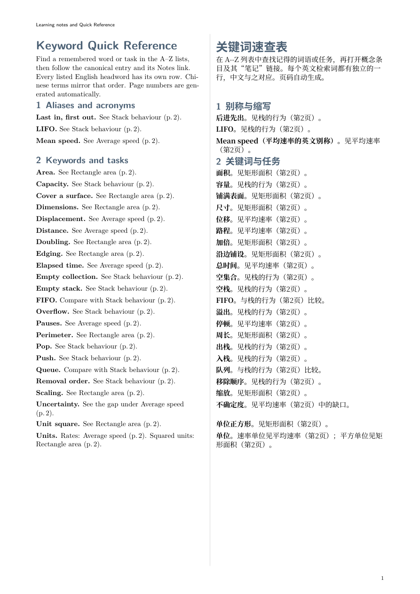

# Complete, runnable examples

Each example keeps source and output together. Download or copy the entire folder to retain its editable LaTeX and images. The four bilingual articles discuss noticing an ordinary street; the English/Chinese example additionally exercises a long flowing paragraph and one shared photograph. The learning set explains average speed, rectangle area and stack behaviour in English and Chinese.

## Browse

| Example folder | Source | PDF |
| --- | --- | --- |
| [English / French](bilingual-pdf/en-fr/) | [JSON](bilingual-pdf/en-fr/source.json) | [Article](bilingual-pdf/en-fr/document.pdf) |
| [English / Chinese](bilingual-pdf/en-zh-Hans/) | [JSON](bilingual-pdf/en-zh-Hans/source.json) | [Article](bilingual-pdf/en-zh-Hans/document.pdf) |
| [English / Arabic](bilingual-pdf/en-ar/) | [JSON](bilingual-pdf/en-ar/source.json) | [Article](bilingual-pdf/en-ar/document.pdf) |
| [Chinese / Japanese](bilingual-pdf/zh-Hans-ja/) | [JSON](bilingual-pdf/zh-Hans-ja/source.json) | [Article](bilingual-pdf/zh-Hans-ja/document.pdf) |
| [Three-concept learning set](course-guide-quick-reference/three-concepts/) | [Teaching source](course-guide-quick-reference/three-concepts/source.md), [source map](course-guide-quick-reference/three-concepts/source-map.json) | [Notes](course-guide-quick-reference/three-concepts/notes.pdf), [Quick Reference](course-guide-quick-reference/three-concepts/quick-reference.pdf) |

Keep `notes.pdf` and `quick-reference.pdf` in the same directory for cross-document links. Some browser PDF viewers restrict opening a second local PDF; the destinations are tested structurally. These short examples omit covers and intentional blank pages.

## Prerequisites

Native builds need XeLaTeX, latexmk, fonts and packages listed in the [language guide](../skills/bilingual-pdf/references/languages.md). The learning project also needs `xr-hyper`. Install a coherent distribution from official sources through your normal approval process. The Ubuntu CI dependencies include:

```sh
sudo apt-get install latexmk texlive-xetex texlive-latex-extra texlive-science texlive-lang-french texlive-lang-arabic fonts-lmodern fonts-noto-core fonts-noto-cjk
```

Structured import and optional PDF checks also need Python dependencies:

```sh
python3 -m venv .venv
.venv/bin/pip install -r requirements.txt
```

Activate the environment before the commands below or replace `python3` with `.venv/bin/python`. Native `.tex`, packages and latexmk configuration are executable input. Disabled shell escape does not sandbox filesystem access.

## Build or adapt an article

In a copied article directory, edit `content.tex` and `languages.tex`, then run:

```sh
latexmk -xelatex -interaction=nonstopmode -halt-on-error -latexoption=-no-shell-escape -jobname=document main.tex
```

The result is `document.pdf` beside its sources. The complete native project does not need Python, JSON or this repository to build. Figure assets are in `images/`.

Alternatively, from the repository root, edit the structured input and choose a fresh destination:

```sh
python3 skills/bilingual-pdf/scripts/bilingual_pdf.py render examples/bilingual-pdf/en-zh-Hans/source.json --output .local/article-build
python3 skills/bilingual-pdf/scripts/bilingual_pdf.py export examples/bilingual-pdf/en-ar/source.json --output .local/editable-article
```

A structured export contains `document.tex`, `languages.tex`, `content.tex`, the package, license and sanitized figures. `render` adds the PDF, a result record and TeX build files. Neither command overwrites an existing output directory. Run `preflight` to check dependencies. See the [input contract](../skills/bilingual-pdf/references/input.md).

## Build the learning set

```sh
cd examples/course-guide-quick-reference/three-concepts
make
```

This builds `notes.pdf` first, then `quick-reference.pdf`, in the same folder. Edit `notes-content.tex` and `quick-content.tex`; `languages.tex` controls the language configuration. `source.md` and `source-map.json` preserve the source scope and claim-to-notes links. Native labels and `xr-hyper` generate notes pointers; page numbers are not maintained by hand.

The [project README](course-guide-quick-reference/three-concepts/README.md) gives equivalent commands without Make. The [coverage record](course-guide-quick-reference/three-concepts/coverage-review.md) distinguishes mechanical checks, author review and open source gaps.

A smaller structured-course compatibility fixture is deliberately kept with the tests:

```sh
python3 skills/course-guide-quick-reference/scripts/course_documents.py tests/fixtures/course-en-fr/source.json --output .local/structured-course
```

It produces flat `notes.pdf` and `quick-reference.pdf`, named editable `.tex` files and localized content/configuration sidecars. This fixture exercises the importer; the public learning example above demonstrates substantive authored teaching notes.

## Ask an agent

- “Use bilingual-pdf with this article and translation. Preserve corresponding meaning, image rights and captions. Give me a reviewed PDF and a portable editable project.”
- “Use course-guide-quick-reference with this authorized teaching source. Create explanatory notes and a keyword/concept Quick Reference, preserving source gaps and generating notes pointers.”

Select paired, left-only or right-only editions with native `ParallelSelect` or structured `--mode`. To change the language pair itself, edit the fonts/languages in `languages.tex` or the structured `languages` field. Review each selected edition separately. For long material, choose the documented flowing-prose route or appropriate semantic boundaries; never shrink or drop text to force a page fit. Do not change translations silently. Inspect every PDF page and verify the source before calling a result complete.

## Previews

### English / French


### English / Chinese


### English / Arabic


### Chinese / Japanese


### Learning notes


### Quick Reference


## Regenerate curated outputs

These are maintainer commands, not installed-skill runtime dependencies. Build in fresh ignored folders:

```sh
python3 tools/export_native_examples.py
python3 tools/sync_renderer.py
export SOURCE_DATE_EPOCH=1767225600 FORCE_SOURCE_DATE=1
python3 tests/render_matrix.py --output .local/new-structured-matrix
python3 tests/native_matrix.py --output .local/new-native-matrix --structured-matrix .local/new-structured-matrix
python3 tools/collect_example_outputs.py --matrix .local/new-structured-matrix --native-matrix .local/new-native-matrix --output .local/new-pdfs --previews .local/new-previews
```

Inspect the generated PDFs and previews. Overlay the contents of `.local/new-pdfs/` and `.local/new-previews/` into `examples/`; their relative paths already match the co-located projects. This replaces only the six PDF outputs, six preview PNGs and `MANIFEST.json`. Keep sources, licenses and other files in place. Then verify:

```sh
python3 tools/collect_example_outputs.py --check --output examples
```

The manifest records source, PDF and preview hashes. Exact PDF bytes require the same engine, packages, fonts and fixed clock; cross-platform byte identity is not claimed. Keep transient builds, logs and private inputs ignored.
