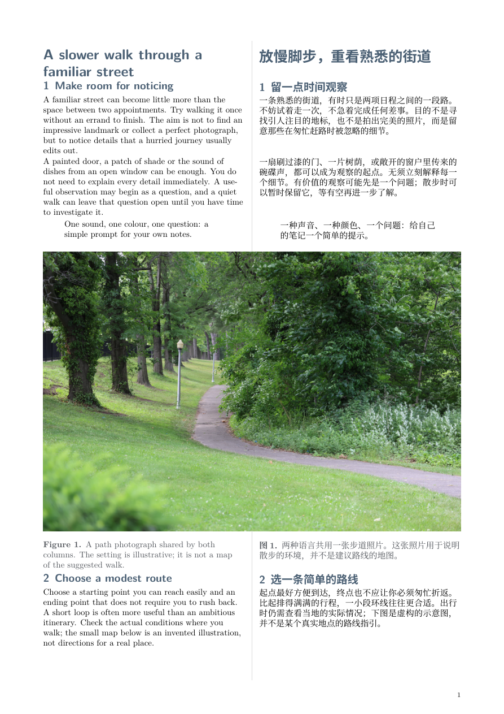

# English / Chinese article

[Open the PDF](document.pdf) · [Structured source](source.json)



Copy this entire folder. Edit `content.tex` and `languages.tex`, keeping authorized images in `images/`, then build:

```sh
latexmk -xelatex -interaction=nonstopmode -halt-on-error -latexoption=-no-shell-escape -jobname=document main.tex
```

The output is `document.pdf` in this directory. Native compilation needs XeLaTeX, latexmk and the declared fonts/packages; it does not need Python or the JSON source. Structured edits can be rendered with the installed bilingual-pdf skill into a fresh output folder. [Build and review guidance](../../README.md).

The bundled [MIT license](LICENSE) covers the original example text and diagram. The shared photograph has separate [CC0 attribution](images/PHOTO-LICENSE.md). Inspect every resulting page and preserve supplied translations.
