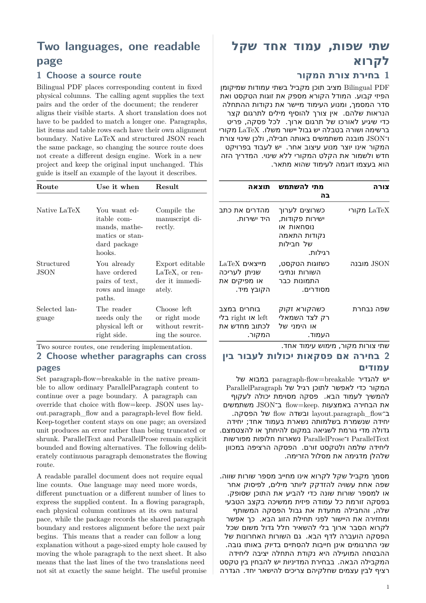

# Bilingual PDF

[English](README.md) · [简体中文](README.zh-CN.md) · [日本語](README.ja.md) · [Français](README.fr.md) · [Deutsch](README.de.md)

対応する内容を比較しやすい位置に配置します。段落の開始位置、リスト項目、表の行を揃え、物理的な左右の列の間に安定した区切り線を置きます。長い段落は一組のまま保持するか、ページをまたいで続けるかを選べます。ネイティブ LaTeX と JSON は、同じ基準となるレイアウトパッケージを使います。

呼び出し元のエージェントが対になる内容を用意します。このスキルはそれをレンダリングするもので、訳文の選定、文章の書き換え、文同士の対応関係の判断は行いません。

## 主な機能

- 訳文の長さにかかわらず、各段落、リスト項目、表の行を個別に揃える
- 段落をページをまたいで続け、その次の組で再び位置を揃える
- 物理的な左右の列の順序と言語の LTR/RTL 方向を分けて扱う
- 共通の全幅画像 1 枚に対訳キャプションを付けるか、言語ごとの画像 2 枚を配置する
- 数式と図のカウンターを共有し、文書内のページリンクを生成する
- 対訳版、左側言語のみの版、右側言語のみの版に加え、用紙・綴じ代の寸法、表紙、ノンブル、意味に基づくスタイル、ナビゲーションを設定できる

[](examples/en-zh-Hans/output.pdf)

[](examples/en-he/output.pdf)

これらは実際の出力のプレビューです。全ページは PDF を開いて確認してください。最初のページの画像は閲覧の補助であり、すべてのページを目視確認した証拠ではありません。

## スキル自身の使い方を示すサンプル

各版は同じ使い方ガイドを題材に、段落、表、図、参照、短い数式を実演します。複数の版に登場する英語と中国語の文章は、それぞれ完全に同一です。

| 言語の組 | PDF | 構造化ソース | ネイティブプロジェクト |
| --- | --- | --- | --- |
| 英語／フランス語 | [output.pdf](examples/en-fr/output.pdf) | [source.json](examples/en-fr/source.json) | [main.tex](examples/en-fr/main.tex) |
| 英語／中国語 | [output.pdf](examples/en-zh-Hans/output.pdf) | [source.json](examples/en-zh-Hans/source.json) | [main.tex](examples/en-zh-Hans/main.tex) |
| 英語／アラビア語 | [output.pdf](examples/en-ar/output.pdf) | [source.json](examples/en-ar/source.json) | [main.tex](examples/en-ar/main.tex) |
| 英語／ヘブライ語 | [output.pdf](examples/en-he/output.pdf) | [source.json](examples/en-he/source.json) | [main.tex](examples/en-he/main.tex) |
| 中国語／日本語 | [output.pdf](examples/zh-Hans-ja/output.pdf) | [source.json](examples/zh-Hans-ja/source.json) | [main.tex](examples/zh-Hans-ja/main.tex) |

サンプル専用の図は `examples/shared/` に一度だけ置きます。実行時に使う `assets/` には、再利用可能なパッケージと任意のプロファイルが含まれます。ネイティブサンプルのコンパイルに Python やリポジトリ保守用ツールは不要です。

## ネイティブ LaTeX

このスキルのインストール先から実行します。

```sh
cd examples/en-fr
latexmk -xelatex -interaction=nonstopmode -halt-on-error -latexoption=-no-shell-escape -jobname=output main.tex
```

自分の文書を作る場合は、サンプル一式を新しいディレクトリへコピーします。パッケージと画像への相対的なパス関係を保つか、必要なパッケージと画像を持ち運べるプロジェクトに含めてください。`content.tex` と `languages.tex` を編集します。[完全なネイティブ API](references/latex.md)には、公開コマンド、引数、既定値、エラーとなる条件、および最小構成の文書が載っています。

プリアンブルで段落全体の方針を設定し、必要に応じて段落ごとに上書きします。

```tex
\ParallelSetup{paragraph-flow=breakable}
\ParallelParagraph{explanation}{Left paragraph.}{Right paragraph.}
\ParallelParagraph[flow=keep]{short}{Keep this pair together.}{Keep this pair together.}
```

`ParallelText` は常に分割不可の単位です。`ParallelProse` はページをまたぐ継続を明示的に許可します。一組に保つ単位が大きすぎる場合は、明示的にエラーになります。レンダラーが内容を縮小したり切り捨てたりすることはありません。

## 構造化 JSON

このスキルのインストール先から実行します。

```sh
python3 scripts/bilingual_pdf.py export examples/en-fr/source.json --asset-root examples/shared --output /path/to/new-project
python3 scripts/bilingual_pdf.py render examples/en-fr/source.json --asset-root examples/shared --output /path/to/new-build
```

`export` は移植可能で編集可能な LaTeX を生成します。`render` はさらにコンパイルとチェックを行います。出力先ディレクトリがすでに存在する場合は拒否されます。`--mode left` または `--mode right` を追加すると、選択した言語のみの版になります。

独立した [JSON Schema](schemas/document.schema.json) と[フィールドリファレンス](references/input.md)を参照してください。`layout.paragraph_flow` で `keep` または `breakable` を設定し、段落の `flow` で上書きできます。`atomic` は `keep` の互換エイリアスとして引き続き使えます。スキーマ検証に加え、実行時に ID、寸法、参照、フォント、アセットのパスを確認します。

画像のパスは入力ディレクトリ内、または明示した `--asset-root` 内に解決される必要があります。絶対パス、ディレクトリトラバーサル、シンボリックリンクによる範囲外へのアクセスは拒否します。アダプターはアセットや依存関係をダウンロードしません。

## レイアウトを分岐させずに設定する

[設定リファレンス](references/configuration.md)では、ページ寸法、綴じ代、区切り線の外観、ノンブル、余白間隔、スタイル、意味上の役割、表紙、ナビゲーションを説明しています。既定値は追加設定なしで使えます。必要な項目だけを上書きするか、文書化されたネイティブフックを使い、内容、言語とフォントの対応、見た目を分けて管理してください。

JSON の表は行を揃えますが、表全体とキャプションを一つの分割不可の単位として扱います。ネイティブの対になる行を `ParallelKeep` の外に置けば、行間での改ページを許可できます。各行自体は分割不可です。行の自動分割や longtable のような見出し行の繰り返しには対応していません。

## 依存関係、確認、納品

XeLaTeX、latexmk、および文書に記載された TeX パッケージとフォントを使います。フランス語のハイフネーション、アラビア語／ヘブライ語の双方向組版、CJK フォント、混在する文字体系については、[言語設定](references/languages.md)を参照してください。構造化入力と任意の PDF チェックには、`requirements.txt` の依存関係、Fontconfig、`kpsewhich` を使います。

[レンダリングの受入チェック](references/acceptance.md)に従い、実際のページで整列、ページをまたぐ継続、字形、RTL の字形処理、欠け、画像、参照、印刷寸法を確認してください。機械的なチェックだけでは意味の正しさを確認できません。合格、不合格、未実施の項目を分けて報告します。

PDF、持ち運べるネイティブのソースプロジェクト、および使用した場合は JSON を納品します。必要なアセットとライセンスを含めてください。ネイティブ TeX と latexmk 設定はコードを実行でき、`-no-shell-escape` はサンドボックスではありません。信頼できるソースか、適切な隔離環境を使ってください。縦書き、任意の浮動体やマクロ引数内の逐語的内容、ネイティブ Windows のフォント検出、PDF/UA はテスト済みの対応範囲外です。

オリジナルのコード、チュートリアル本文、図は [MIT ライセンス](LICENSE)です。外部の依存関係にはそれぞれのライセンスが適用されます。公開サンプルに非公開文書の内容を含めないでください。
