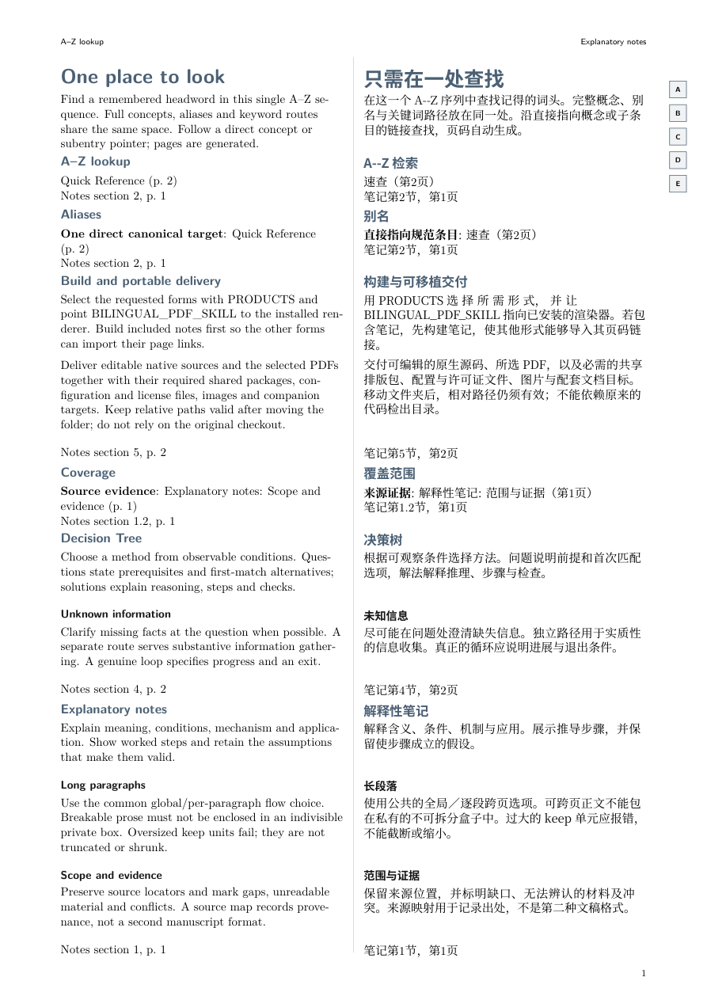
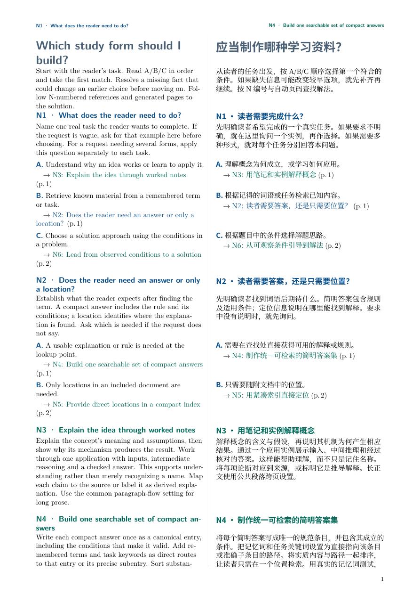

# Study Notes

[English](README.md) · [简体中文](README.zh-CN.md) · [日本語](README.ja.md) · [Français](README.fr.md) · [Deutsch](README.de.md)

制作读者真正需要的学习工具：讲解型笔记、统一速查手册、精简关键词索引或决策树，可以单独选择，也可以组合使用。稿件采用原生 LaTeX，由已安装的 `bilingual-pdf` 技能负责渲染。

## 四种可选形式

| 形式 | 读者的问题 | 输出 |
| --- | --- | --- |
| 笔记 | “这是什么意思，又是如何运作的？” | `notes.pdf` |
| 统一速查手册 | “我记得一个术语或任务，应该查哪个相关概念？” | `quick-reference.pdf` |
| 关键词索引 | “相关概念在哪里？” | `keyword-index.pdf` |
| 决策树 | “根据目前知道的信息，下一步该做什么？” | `decision-tree.pdf` |

默认生成笔记和速查手册。速查手册将正式概念条目、别名和关键词导向条目交织排列在同一个有序的词头空间中。读者无需先在关键词区与概念区之间做选择。独立的关键词小册子是可选项，不是必须额外查询的第二个入口。

[](examples/quick-reference.pdf)

[](examples/decision-tree.pdf)

## 以自身用法为内容的学习示例

[原创教学源文](examples/source.md) 解释如何选择和构建这四种形式。其[来源映射](examples/source-map.json)、原生稿件、PDF 和预览图统一放在 `examples/` 下：

- [笔记](examples/notes.pdf)：讲解与选择过程示范
- [统一速查手册](examples/quick-reference.pdf)：一个交织排列的查询空间
- [关键词索引](examples/keyword-index.pdf)：精简的自动生成指引
- [决策树](examples/decision-tree.pdf)：自然的问题、备选项、澄清步骤与方法

这些示例用技能自身的主题演示其用法。独立的使用说明、[编写指南](references/authoring.md)、[原生 API](references/native-api.md)、[构建指南](references/rendering.md) 和[审查清单](references/review-release.md) 仍以可读的 Markdown 保留。

## 安装并查找渲染器

通过宿主安装 `study-notes` 和 `bilingual-pdf`。查找两者的实际安装目录，它们可能位于互不相关的路径；不要假定安装在相邻目录。

```sh
export BILINGUAL_PDF_SKILL="/path/reported/by/host/bilingual-pdf"
export STUDY_NOTES_SKILL="/path/reported/by/host/study-notes"
```

`bilingual-pdf/assets/paralleltext.sty` 负责页面尺寸、字体、段落对齐、跨页延续、插图、语义角色、封面和渲染检查。本技能的 `studytools.sty` 添加原生记录与导航功能，不会下载依赖，也不携带第二套渲染器。

共用版式 API 请参阅双语技能独立的原生、语言和配置参考。原生构建需要 XeLaTeX、latexmk 以及文档列出的字体和包。Python 仅用于可选的仓库／PDF 质量检查；此技能不提供 JSON 稿件适配器。

## 只构建需要的形式

将 `examples/` 复制到新项目，保留已查得的技能路径，并将教学稿件替换为你有权使用的内容。在该项目中执行：

```sh
make BILINGUAL_PDF_SKILL="$BILINGUAL_PDF_SKILL" STUDY_NOTES_SKILL="$STUDY_NOTES_SKILL"
make PRODUCTS='decision-tree' BILINGUAL_PDF_SKILL="$BILINGUAL_PDF_SKILL" STUDY_NOTES_SKILL="$STUDY_NOTES_SKILL"
make PRODUCTS='notes quick-reference keyword-index decision-tree' BILINGUAL_PDF_SKILL="$BILINGUAL_PDF_SKILL" STUDY_NOTES_SKILL="$STUDY_NOTES_SKILL"
```

第一条命令选择笔记和速查手册。如果某份文档引用配套笔记，应先构建已选的笔记。未选择的配套文档不得导致失效的外部链接。使用相对路径跨文档链接时，请将 PDF 放在一起；各阅读器对此类链接的支持程度不同。

移交可独立使用的原生项目时，包含所需的 `paralleltext.sty`、`studytools.sty`、`study-tree.tex`、`study-graph-components.tex`、稿件／配置文件及许可证。交付时复制必要文件不等于另外维护一套已安装的渲染器。[构建指南](references/rendering.md) 提供直接使用 latexmk 的命令和依赖检查方法。

## 一个查询注册表

正式概念及有意义的子条目只需声明一次。将读者可能记住的词、别名和缩略词直接导向准确的概念或子条目。生成的引用包含相关标题／语境和实际目标页码；配套文档信息可用时，还会包含该文档的标识、节号／页码。

查询身份需要显式指定，并与排序键分开。明确属于同一词头组的记录会一起出现；仅凭标点归一化，不应将不同含义合并。若术语表定义没有含义相等的正式概念讲解，就应保留其独立内容，不能当作“相关”链接丢弃。

同一套原生注册表可以生成统一速查手册，也可以生成精简索引。分组、别名、多目标导向、子条目、简短页眉及导航钩子见[原生声明参考](references/native-api.md)。

## 用问题引导到方法

使用[原生决策图组件](references/graph-components.md)，提出自然问题，并在问题处说明所需前提。按 A/B/C 顺序选择第一个符合的条件。自动生成的 N1、N2 等引用与内部语义键分离。每个解法都应解释回答问题所需的推理、操作和检查。

尽可能在问题旁补齐缺失信息。只有信息收集本身是实质任务时，才设置独立分支，不必为每个问题强加未知路线。循环可以保留，但须说明携带的状态、进展与退出条件。共享渲染器保留问题蓝色、解法绿色的角色样式。

## 长段落与可复用呈现

使用 `ParallelSetup{paragraph-flow=breakable}` 配合 `ParallelParagraph`，并在适当时用 `[flow=keep]` 为单个段落覆盖设置。不要把可跨页正文包进不可拆分的私有盒子。权威渲染器支持双语对照和选定语言版本的跨页延续，并在下一个单元前恢复对齐。过大的整组保留区块会报错，不会截断或缩小内容。

下游项目应固定经过测试的技能修订版本，将私有内容、元数据和轻量兼容适配器留在自己的项目中。缺少的通用能力应添加到共享渲染器，避免维护私有版式分支。

## 审查与交付

分别检查来源覆盖、讲解质量、真实查询路线、决策路径、链接和实际 PDF 页面。没有证据时，不要声称内容完整或已经过独立审计。交付选定的 PDF、来源映射和可移交、可编辑的项目，并报告通过、失败和未执行的检查。

原生 TeX 和 latexmk 配置可以执行代码。禁用 shell escape 不能隔离文件访问。私有源材料、姓名、标识符和来源记录不得进入公开示例；外部处理或发布前需取得适用授权。原创代码与内容采用 [MIT 许可证](LICENSE)，依赖保留各自的许可证。
